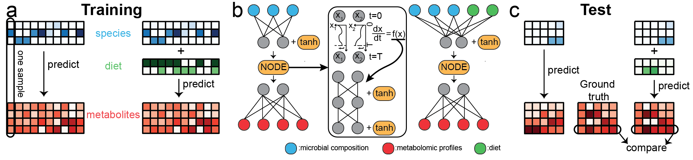

# mNODE (Metabolomic profile predictor using Neural Ordinary Differential Equations)
This repository contains scripts needed to run `mNODE` (Metabolomic profile predictor using Neural Ordinary Differential Equations) that is capable of predicting metabolomic profiles based on microbial compositions and other additional information such as dietary information. A preprint that describes the method in detail can be found [here](https://www.biorxiv.org/content/10.1101/2022.06.23.497381v1). 


## Versions
The version of Python we used is 3.7.3 and the version of Julia we used is 1.6.2.

## Dependencies
Necessary Python packages can be found in `requirements.txt`. Installing those packages can be achieved by pip:
```
pip install -r requirements.txt
```
Julia uses the toml to manage the version of packages. Necessary Julia packages are specified in `Project.toml` and `Manifest.toml`. To ensure all dependent packages will be correctly installed, we include
```
using Pkg
Pkg.instantiate()
```
which automatically installs all packages specified in `Project.toml` and `Manifest.toml`.

The entire installation process takes less than half an hour for the setting we used (Macbook Air M1 2020, 8GB RAM, 512GB SSD).

## Workflow
1. **Data processing**: we apply the CLR (Centred Log-Ratio) transformation to both microbiome and metabolomic profiles and this is carried out by the Python script `data_processing.py`. After the CLR transformation, the script prepares the training and test datasets. It requires the microbiome and metabolomic profiles for both training and test. In addition, it needs annotated names for metabolites in metabolomic profiles. For the example we are going to demonstrate, it loads the raw count data from the folder `./data/IBD` and saves the processed data to the folder `./processed_data`.
2. **mNODE**: the Julia script `mNODE.jl` loads the processed data in `./processed_data` and starts the prediction procedure of mNODE. It first utilized the 5-fold cross-validation on the training set to determine the best hyperparameters (L2 regularization weight parameter and hidden layer size). Then it predicts CLR-transformed metabolomic profiles for the test set. The final predicted CLR-transformed metabolomic profiles are saved as `./results/predicted_metabolomic_profiles.csv` and the Spearman Correlation Coefficients for all metabolites are saved as `./results/metabolites_corr.csv`.
3. **Inferring microbe-metabolite interactions**: the Julia script `inferring_interactions.jl` loads the processed data in `processed_data` and directly used the best hyperparameters to train mNODE. The susceptibility method measures responses of metabolite concentrations to the perturbation in species' relative abundances of the trained mNODE on the training set. All values of susceptibilities are saved as `./results/susceptibility_all.csv`.

## Example
We showed a demonstration of mNODE on the dataset PRISM + NLIBD. First, we need to process both microbiome profiles and metabolomic profiles using the CLR (Centred Log-Ratio) transformation. The data is processed by the Python script titled `data_processing.py`:
```
<PATH_TO_PYTHON> ./data_processing.py PATH_metab_df PATH_micro_df PATH_external_meta_df PATH_external_micro_df PATH_metabolome_annotated
```
<PATH_TO_PYTHON> is the path to the executable Python file located under the installed folder. PATH_metab_df, PATH_micro_df, PATH_external_meta_df, PATH_external_micro_df, and PATH_metabolome_annotated are paths to the training metabolomic profiles, training microbiome profiles, test metabolomic profiles, test microbiome profiles, and annotated metabolites in metabolomic profiles respectively. For the IBD dataset we demonstrate here, the command for processing the dataset is 
```
python ./data_processing.py "./data/IBD/metabolome_PRISM.csv" "./data/IBD/microbiome_PRISM.csv" "./data/IBD/metabolome_external.csv" "./data/IBD/microbiome_external.csv" "./data/IBD/metabolome_annotation.csv"
```
After the data processing, we can run mNODE (including hyperparameter calibration and the following predictions) contained in `mNODE.jl` via the command:
```
<PATH_TO_JULIA> ./mNODE.jl
```
<PATH_TO_JULIA> is the path to the executable Julia file located under the installed folder. Finally, to infer microbe-metabolite interactions via the susceptibility method, we can run `inferring_interactions.jl`:
 ```
<PATH_TO_JULIA> ./inferring_interactions.jl
```

For example, on the Macbook air M1 2020 we tested, the command for running `mNODE.jl` is 
```
/Applications/Julia-1.6.app/Contents/Resources/julia/bin/julia ./mNODE.jl
```

The entire running process takes less than 20 minutes for the setting we used (Macbook Air M1 2020, 8GB RAM, 512GB SSD).

## License

This project is covered under the **MIT License**.